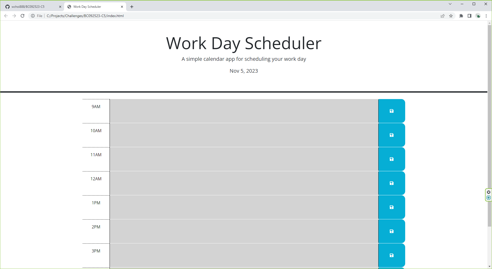

# Web Development Quiz Game

The Workday Scheduler is a user-friendly calendar application designed to help you efficiently manage your workday from 9 AM to 5 PM. This scheduler provides a visual representation of your work hours, making it a valuable tool for staying organized and on track. With this simple and intuitive web application, you can easily save events for each hour of your typical working day, ensuring that you never miss an important task or appointment.

## Installation

N/A

## Usage

The Workday Scheduler displays the current day at the top of the calendar and provides time blocks for the standard business hours of 9 AM to 5 PM. These time blocks are color-coded to indicate whether they are in the past, present, or future. To schedule an event, simply click on a time block, enter your event details, and save it. Your events are stored in local storage, ensuring they persist even after page refresh. This intuitive calendar application simplifies workday organization and time management.

## Credits

## License

Please refer to the LICENSE in the repo.

## Webpage URL

https://wchoi888.github.io/BC092523-C5/

## Screenshot

